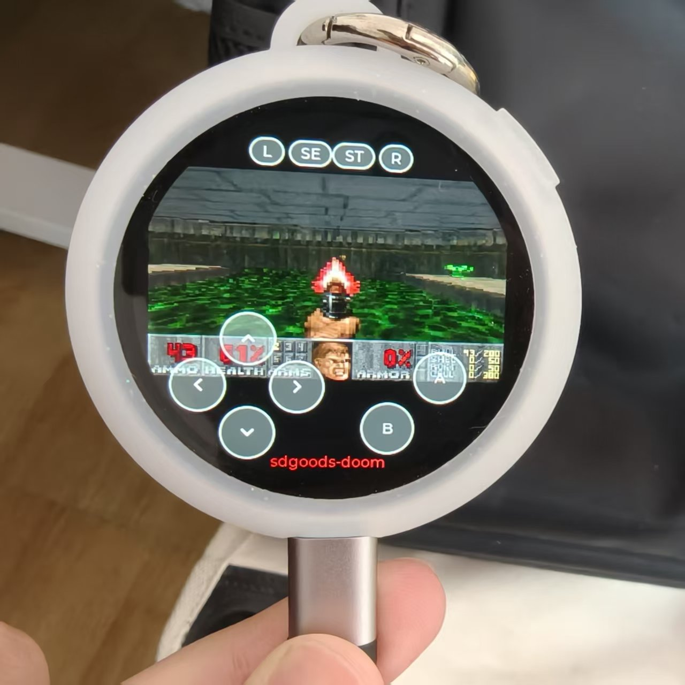
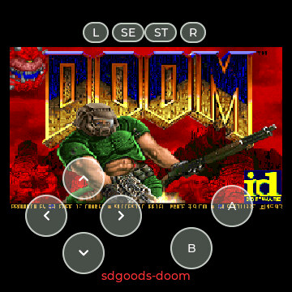
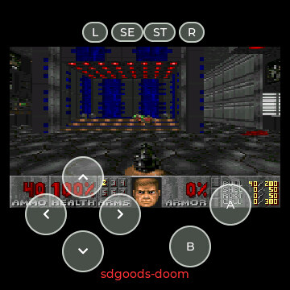
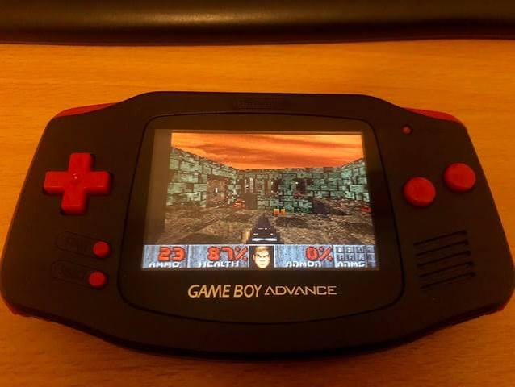

# SDGOODS DOOM

在 SDGOODS 谷仓次元屏（ESP32-S3 圆形触摸屏）上运行 DOOM。屏幕上的虚拟键操作，单应用直启固件，开机直接进游戏。



| 标题画面 | 关卡内（E1M1） |
|:---:|:---:|
|  |  |

  

GBADoom 当年把 DOOM 编译到了 Game Boy Advance，本项目把同一条引擎链路搬到圆形触摸屏上。下面这张 GBA 实拍作为血统注脚：



## 硬件

| 项目 | 规格 |
|------|------|
| MCU | ESP32-S3-R8，双核 LX7 @240MHz，8MB Octal PSRAM |
| Flash | 32MB（QSPI） |
| 屏幕 | 圆形 360×360，ST77916，QSPI，RGB565 |
| 触摸 | CST816 单点电容触摸（I2C） |
| 按键 | 仅 1 个电源键，方向/动作全靠触屏虚拟键 |
| 引擎 | [GBADoom](https://github.com/YeatsLiao/GBADoom)（YeatsLiao fork，分支 `esp32-sdgoods`，PrBoom 血统） |

单点触摸同一时刻只感应一根手指，所以按键全部设计成"按住生效、松手即停"，方向和开火分置画面两侧。

## 快速开始

直接刷发布好的整机镜像，里面已打包引导层 + 分区表 + 固件 + WAD + 音效。

1. 从 [Releases](https://github.com/YeatsLiao/sdgoods-doom/releases) 下载 `sdgoods-doom-full.bin.zip`，解压得到 `sdgoods-doom-full.bin`（约 7.7MB）。
2. 接上 USB-C，一条命令刷入：

   ```powershell
   esptool.py --chip esp32s3 -p COM6 -b 921600 write_flash 0x0 sdgoods-doom-full.bin
   ```

3. 刷完等它自动重启（或拔插一次 USB-C），即进 DOOM。

本机只有一个电源键，没有 BOOT / RST——正常 USB-C 直连、`write_flash` 就能刷，无需手动进下载模式。万一 esptool 卡在 `Connecting...`，重新拔插一次 USB-C 再试即可。想退回官方固件，走平台安装通道重刷即可，不会变砖。

WAD 和音效含 id Software 版权素材，只作为 Release 资产提供，`git clone` 里没有这两个文件。

## 编译

需要 ESP-IDF v5.5 和 GBADoom 源码（放同级目录）。

```powershell
git clone -b esp32-sdgoods https://github.com/YeatsLiao/GBADoom ../GBADoom
idf.py -B build_pub build            # 产物 build_pub/SDGOODS_DOOM.bin（约 1.3MB）
python tools/make_full_bin.py        # 合并出 sdgoods-doom-full.bin
```

构建期会自动给 GBADoom 的 `z_zone.c` 打一处幂等补丁，把 128KB overflow 缓冲从内部 SRAM 迁到 PSRAM，否则 `dram0` 链接溢出。

## 分区与烧录地址

紧凑单体布局，见 `platform/partitions.csv`：

| 落点 | 内容 |
|------|------|
| `0x0` | bootloader（本工程自编，与 app 同一套构建） |
| `0x8000` | partition-table |
| `0x10000` | `SDGOODS_DOOM.bin`（factory，2MB） |
| `0x210000` | `DOOM1_PROCESSED.WAD`（appdata 头部） |
| `0x690000` | `DOOM_SFX.bin`（appdata + 0x480000，可选） |

没有 otadata 和 OTA 槽，bootloader 直接回落 factory 直启。代码按分区名 `appdata` + 相对偏移找 WAD 和音效，绝对地址可自定义。改了分区表就要整块重刷（`write_flash 0x0 full.bin`），别只刷 app。

## 按键

| 键 | 作用 |
|------|------|
| ▲ / ▼ | 前进 / 后退 |
| ◀ / ▶ | 左转 / 右转 |
| A | 开火 |
| B | 使用 / 开门 |
| L / R | 切换武器 |
| ST / SE | 菜单 / 确认 |

顶部向下滑唤出控制中心，调音量和亮度。

## 注意

- WAD 必须用 `DOOM1_PROCESSED.WAD`（1176 lumps，3,904,360 字节）。烧成 `DOOM1_GBA.WAD` 会让引擎 `P_GroupLines` 崩溃、进关卡黑屏；纯净原版 `DOOM1.WAD` 也跑不了，引擎硬依赖 `STGANUM`/`M_ARUN`/`M_GAMMA` 补丁 lump。
- 没声音：确认烧了 `DOOM_SFX.bin`、音量不为 0。串口日志应有 `doom_snd: soundbank loaded`。背景音乐（BGM）尚未实现。
- 抓真机画面（不用拍屏）：`python tools/screenshot_recv.py -p COM6 -t -o shot.jpg`。

## 项目结构

```
sdgoods-doom/
├── components/
│   ├── bsp/              板级支持：屏/触摸/音频/LVGL/字体/电源/手势
│   ├── control_center/   控制中心（顶部下滑浮层）
│   ├── doom_engine/      GBADoom 引擎胶水 + 平台层
│   │   ├── esp32_wad.c        从 appdata mmap WAD
│   │   ├── i_sound_esp32.c    音效：soundbank→PSRAM + 混音 + I2S
│   │   └── i_system_sdgoods.c backbuffer/调色板/键边沿检测
│   └── jpegenc/          截屏 JPEG 编码
├── main/
│   ├── main.c            开机直进 DOOM
│   └── game/ui_doom.c    LVGL 外壳：canvas + 虚拟键 + 帧提交
├── platform/partitions.csv
├── tools/                make_full_bin.py / gen_soundbank.py / screenshot_recv.py / flash_local.sh
└── .github/workflows/    CI：clone GBADoom + 构建 + 挂 Release 资产
```

## License

本工程是多许可混合，按目录区分：

| 部分 | 许可 | 说明 |
|------|------|------|
| `components/doom_engine/` + GBADoom 引擎 | GPL-2.0-or-later | 完整文本见 [LICENSE](LICENSE) |
| `components/bsp`、`control_center`、`jpegenc` | Apache-2.0 | © 深圳希德创新网络有限公司（SDGOODS），保留原始版权头，见 [NOTICE](NOTICE) |
| `main/*` 应用外壳 | Apache-2.0 | 与 GPL 引擎合并后，整体固件产物按 GPL-2.0 分发 |
| `DOOM1_PROCESSED.WAD` / `DOOM_SFX.bin` | 游戏数据，© id Software | 含版权素材，仅作合法试用分发，不入库 |

> 本项目与 SDGOODS / 谷仓官方无隶属关系，仅使用该硬件平台；项目名、产品名与 SDGOODS 标识不在代码许可授权范围内。
> WAD 与音效请自行通过官方渠道获取，勿用于商业分发。
